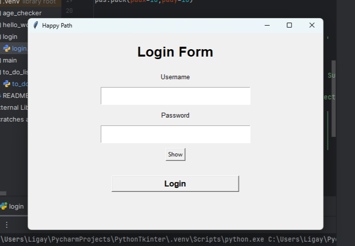

# Python Tkinter Mini Projects

This repository contains **beginner-friendly Python GUI projects** built with **Tkinter**.  
Each project is window-based and focuses on understanding essential GUI programming concepts like **widgets, events, functions, and basic input validation**.

---

## Projects

1. **Age Checker GUI**  
   - Input your age to check if you're an adult or a minor.  
   - Practices using `Entry`, `Button`, `Label`, and message boxes.

2. **Login GUI (Happy Path Only)**  
   - Simple login interface demonstrating input handling and button events.  
   - Focuses on layout and event response without authentication logic.
   

---

## Notes

- Code is created for **personal practice and learning Tkinter**.  
- Inline comments
